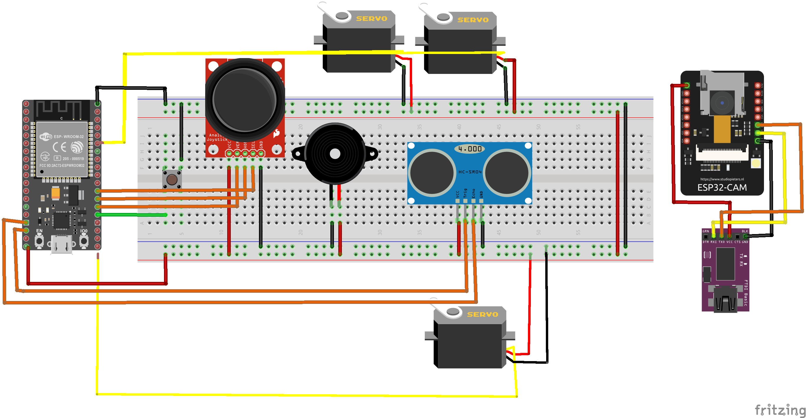

# Object Classification with distance from sensor
Object Classification with distance sensor was originally made for our team "Embedded System" final project.

### Member
|||
|-|-|
|119140214|Farid Anfasha|
|119140224|Andhika Putra Pratama|
|119140225|Rayhan Atthala Ghifary|

## Diagram Project

## Item
### Hardware
1. 🖥️ ESP32 Dev Kit
2. 📷 ESP32-CAM
3. :ballot_box_with_check: FTDI FT232RL
4. :black_large_square: Ultrasonik HC-SR04
5. :joystick: Dual Axis Joystick Module
6. :gear: Micro Servo MG90S
7. :speaker: Buzzer
8. :white_square_button: Push Button

### Addition Item
1. Jumper
2. Bracket XY
3. Whiteboard

### Software
1. Arduino IDE
2. COCO-SSD

## Use instructions
1. Make sure you have already installed ESP32 (ESP32-CAM) add-on on Arduino IDE and the driver is working fine
2. Clone this git
3. Set all items according to the system schematic.
4. Open code in ESP32-Dev-Module folder and upload to ESP32-Dev-Kit
5. Open code in ESPCAM-coco-SSD folder and upload to ESP32-CAM (Make sure SSID and password have been changed)
6. Open Browser and enter the ESP32-CAM IP Address

## Demo Video
LOREM IPSUM

## References
* [ESP32-CAM Streaming Web Server](https://randomnerdtutorials.com/esp32-cam-video-streaming-face-recognition-arduino-ide)
* [ESP32 with HC-SR04 Ultrasonic Sensor ](https://randomnerdtutorials.com/esp32-hc-sr04-ultrasonic-arduino)
* [Joystick Module](https://create.arduino.cc/projecthub/MisterBotBreak/how-to-use-a-joystick-with-serial-monitor-1f04f0)
* [COCO SSD Tensorflow.js Model](https://github.com/tensorflow/tfjs-models/tree/master/coco-ssd)
* [ESP32-CAM COCO-SSD](https://github.com/fustyles/Arduino/tree/master/ESP32-CAM_Tensorflow.js/ESP32-CAM_coco-ssd)
